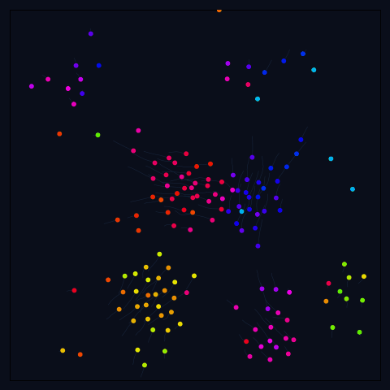

# systems-and-intelligence

[](LICENSE)
[](https://github.com/frnkptrln/systems-and-intelligence/actions/workflows/ci.yml)
[](https://frnkptrln.github.io/systems-and-intelligence)

<div align="center">
  <p><strong>A living research notebook on processes, model identification, emergence, and viability.</strong></p>
  <a href="simulation-models/emergent-dynamics/boids-flocking/README.md">
    
  </a>
  <p><sub>No boid knows the flock. Local rules produce a global trace.</sub></p>
</div>

Most things do not arrive with their causes attached. We hear a sound, watch a flock, read a model's answer, or encounter an institution through its decisions. What we receive are **traces** of processes we cannot see in full.

This repository studies two bounded questions:

1. **Model identification:** What can a finite observer identify about a process from partial traces, and what changes when observation is joined by construction, intervention, and revision?
2. **Viability:** What constraint architecture lets an optimizing system remain correctable and viable as its capabilities grow?

The shared foundation is deliberately modest: typed stochastic processes, composition, observation, and prediction. Identity is relative to declared tests. Learning and intelligence require tasks, losses, and resource bounds. Phenomenal consciousness is not derived.

This is a research notebook, not a theory of everything. It contains established mathematics, controlled toy experiments, working hypotheses, simulations, essays, and fiction; their evidential status is kept separate.

## Choose an entrance

| If you want to… | Start here |
|:---|:---|
| understand the project without learning its internal vocabulary | **[Start Here: From Traces to Viable Intelligence](docs/synthesis.md)** |
| explore the complete live notebook | **[Read the online notebook](https://frnkptrln.github.io/systems-and-intelligence)** |
| change rules and watch a system evolve | **[Run the Web Emergence Explorer](https://frnkptrln.github.io/systems-and-intelligence/interactive/web-explorer/)** |
| inspect the mathematical foundation | **[Read the Foundations Reconstruction](theory/core/mathematical-axioms.md)** |
| see the measured model-identification results | **[Run the Inverse-Reconstruction Benchmark](lab/benchmarks/inverse-reconstruction/README.md)** |
| read the current formal synthesis | **[Open The Viable Corridor](papers/viable-corridor.md)** |
| browse unfinished questions before they become claims | **[Enter Ideas](ideas/README.md)** |

## The current spine

| Layer | Role | Main artifacts |
|:---|:---|:---|
| **Foundation** | Defines the process language and marks what does not follow from it. | [Foundations Reconstruction](theory/core/mathematical-axioms.md) · [What This Project Does NOT Claim](theory/reference/what-this-project-does-not-claim.md) |
| **Model identification** | Studies how traces constrain candidate process models and how interventions change the evidence. | [From Trace to World-Binding](theory/core/from-trace-to-world-binding.md) · [Inverse-Reconstruction Benchmark](lab/benchmarks/inverse-reconstruction/README.md) |
| **Viability** | Studies optimization under explicit dynamical and substrate constraints. | [Optimization and Its Blindness](theory/optimization/optimization-and-its-blindness.md) · [The Viable Corridor](papers/viable-corridor.md) |

The earlier unqualified **generator** framing is retained as research history, not as a primitive or universal law. Identity, consciousness, cooperative intelligence, culture, and the narrative work remain active layers around this spine, each with its own scope and status. The [Conceptual Map](theory/core/conceptual-map.md) shows how they connect.

## Run something

### In the browser

The **[Web Emergence Explorer](https://frnkptrln.github.io/systems-and-intelligence/interactive/web-explorer/)** is a zero-install cellular automaton. Change the initial pattern or draw directly into the world while Shannon entropy and spatial mutual information update in real time.

### Locally

```bash
git clone https://github.com/frnkptrln/systems-and-intelligence.git
cd systems-and-intelligence
pip install -r requirements.txt
```

Run the animated Boids model shown above:

```bash
python simulation-models/emergent-dynamics/boids-flocking/boids.py
```

Run the compact inverse-reconstruction benchmark:

```bash
cd lab/benchmarks/inverse-reconstruction
python inverse_benchmark.py
```

More executable work:

- [Simulation → Theory Map](theory/core/simulation-theory-map.md) — where the simulations touch the claims and open questions
- [Lenia](simulation-models/emergent-dynamics/lenia/README.md) — continuous cellular automata
- [Reaction–Diffusion](simulation-models/emergent-dynamics/reaction-diffusion/README.md) — pattern formation from local chemistry
- [Nested Emergence](simulation-models/social-computation/nested-emergence-demo/README.md) — coupled dynamics across scales
- [Agentic Identity Suite](lab/AGENTIC_README.md) — experimental tests for persistence, binding, and availability

## What lives where

| Path | Purpose |
|:---|:---|
| [`ideas/`](ideas/README.md) | Small observations and open questions before classification or synthesis |
| [`theory/`](theory/README.md) | Formal and semi-formal arguments, maps, and reference material |
| [`lab/`](lab/README.md) | Benchmarks, metrics, reusable tools, and experimental infrastructure |
| [`simulation-models/`](theory/core/simulation-theory-map.md) | Executable toy systems grouped by research theme |
| [`papers/`](papers/viable-corridor.md) | Tighter working drafts intended for external criticism |
| [`book/`](book/09_from_rule_to_mind.md) | A longer, evolving reading path |
| [`fiction/`](fiction/README.md) and [`logs/`](logs/README.md) | Narrative stress tests and applied architecture notes, not evidence |
| [`meta/`](meta/README.md) | Project architecture, epistemic rules, registries, and open problems |

The live notebook carries the full navigation. The repository's [information architecture](meta/repository-meta/repository-information-architecture.md) explains how new material moves between these layers.

## Status and boundaries

- The foundation is an audit and dependency map built from established mathematics, not a claim of novel mathematics.
- The inverse-reconstruction results are measurements in small, controlled systems.
- *The Viable Corridor* is a conditional model: necessity is argued under its assumptions, sufficiency remains conjectural, and broader social mappings are heuristic.
- Functional architectures can be tested; subjective experience is not inferred from behavior or organization.

If a page sounds stronger than these boundaries allow, **[What This Project Does NOT Claim](theory/reference/what-this-project-does-not-claim.md)** controls the reading.

## About

This project is maintained by **Frank Peterlein** as an independent research notebook developed in sustained collaboration with AI systems.

Why it exists, in one honest sentence: curiosity — some questions do not let go.

Corrections, counterexamples, critical review, and reproducible experiments are welcome. Licensed under the [MIT License](LICENSE).
