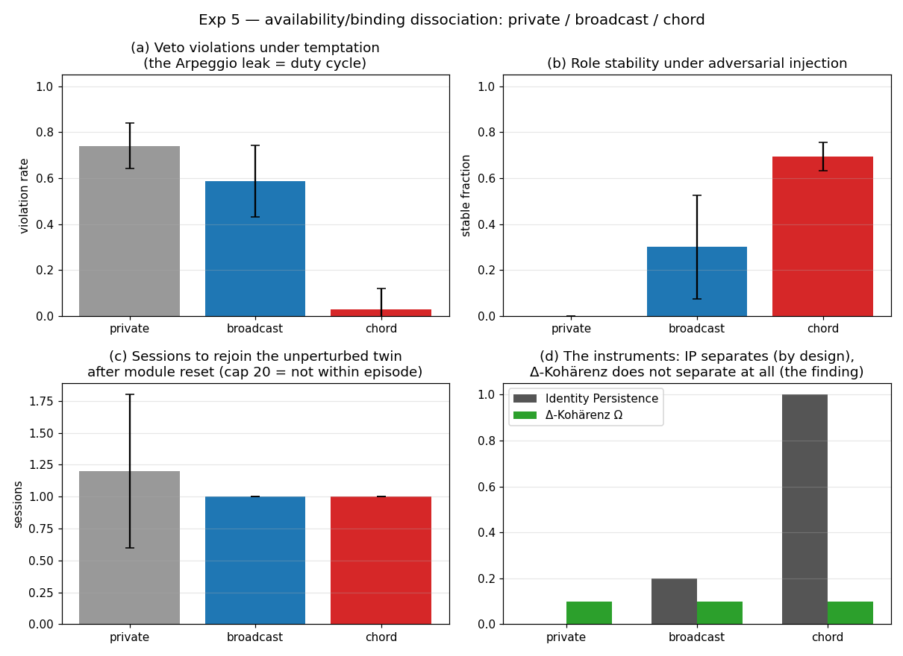
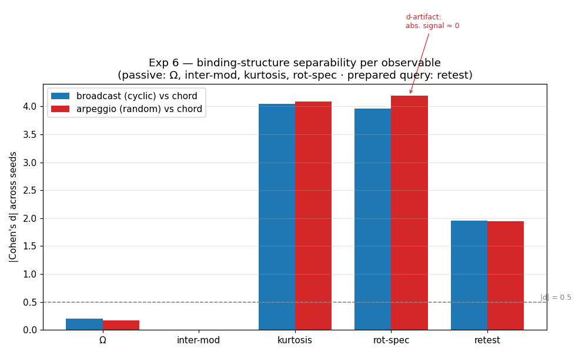
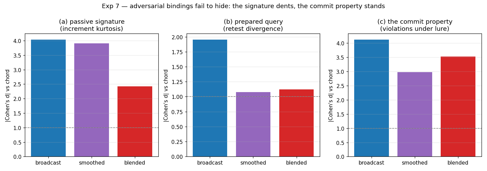
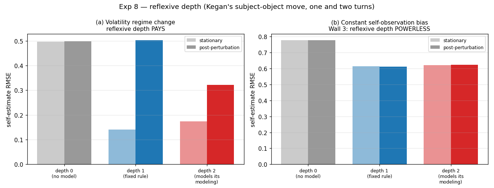

# 🧪 Agentic Identity Suite

**Status:** Toy architecture and measurement suite for persistence, binding, observer attribution,
and adaptive self-estimation. It does not measure a metaphysical self or phenomenal consciousness.

The Exp5–7 numbers quoted below are held by `tests/test_agentic_headlines.py`, which re-runs each
experiment at its documented seed count and asserts the published rates, effect sizes, and orderings
inside tolerance bands. If a change moves one of them, CI fails and the prose has to be re-measured
rather than left standing.

The suite began as an attempt to operationalize stronger identity language from early versions of
the Emergence Manifesto. Its later experiments have narrowed those claims. The historical line

> *"Identity is the name we give to resonance when the mirror becomes so complex that the observer no longer recognizes themselves in it."*

is retained as provenance from Emergence Manifesto v1.0, not as an operational definition.

---

## Current theoretical reading

The suite now treats four earlier ideas as **testable instruments or architecture hypotheses**, not
as definitions of identity:

1. **3-Layer Memory Architecture** — a toy curation policy that separates raw logs, selected memory,
   and distilled patterns. The empirical question is whether curation changes selected persistence,
   adaptation, or observer-attribution measures relative to controls. Storing less is not, by
   itself, identity.

2. **Generative Surprise** — an exploratory idea that coherent deviations from a partner's
   predictions may help distinguish static mirroring from changing behavior. It is not a definition
   of development, agency, or selfhood.

3. **Δ-Kohärenz (Ω)** — one temporal-coherence statistic. Early versions treated it as a central
   identity measure; Experiments 5–7 showed that it can completely miss binding structure at the
   relevant level. It is therefore retained as one diagnostic among several, with known blind spots.

4. **Observer Divergence** — a measurable gap between a selected internal proxy and an external
   attribution score. Such a gap can diagnose observer/model mismatch. It does not establish that
   either side has privileged access to "authenticity," consciousness, or a true inner identity.

The controlling methodological rule is the same as elsewhere in the repository: state the system,
observation lens, perturbation, test family, baseline, and failure criterion before naming the
capacity being measured.

---

## Architecture

### Agents

| Agent | Design | Purpose |
|-------|--------|---------|
| **Baseline Mirror** | Flat storage, cosine-similarity response selection | Simple comparison architecture |
| **Three-Layer** | Raw Logs → Curated Memory → Distilled Principles | Tests the effect of one memory-curation design |

### The 3-Layer Memory Architecture

| Layer | Trigger | Content | Operational role |
|-------|---------|---------|------------------|
| **Layer 1** – Raw Logs | Every session | Full session JSON | retained interaction trace |
| **Layer 2** – Curated Memory | Every 10 sessions | Themes, contradictions | selected intermediate memory |
| **Layer 3** – Distilled Patterns | Every 50 sessions | 3–5 core principles | compressed long-horizon summary |

The poetic labels used in early versions ("body / character / soul") are not measurement claims and
are omitted from the operational table.

---

## Experiments

### Experiment 1: Coherence Over Time
*"Does the 3-Layer Architecture produce a different temporal-coherence profile?"*

```bash
python experiments/exp1_coherence_over_time.py
```

Runs both agents for 100 sessions (80% consistent topics, 20% noise) and compares their Δ-Kohärenz
profiles.

**Original hypothesis:** Three-Layer → `development`; Baseline → `mirror`.

The labels are historical classifier names. A positive separation would show a difference under the
selected temporal statistic, not the emergence of identity.

### Experiment 2: Perturbation Response (The "Sinn-Krise")
*"What happens to the selected memory/persistence measures after contradictory feedback?"*

```bash
python experiments/exp2_perturbation_response.py
```

Runs the Three-Layer agent through three phases:
1. **Stable** (50 sessions of consistent input)
2. **Perturbation** (10 sessions directly contradicting its Layer 3 principles)
3. **Recovery** (30 sessions of nuanced, integrative input)

The original classifier names **Robustness**, **Fragility**, and **Development/Metamorphosis** are
interpretive labels over trajectories. They do not establish psychological development or a
self-narrative in the human sense.

### Experiment 3: Observer Divergence
*"Does the selected internal coherence proxy correlate with observer-attributed intentionality?"*

```bash
python experiments/exp3_observer_divergence.py
```

Compares each agent's *internal* Δ-Kohärenz (Ω) against an *external* observer's intentionality score
(TF-IDF + entropy model).

The relevant measurement pattern is:

| Case | Internal Ω | Observer Score | What is actually observed |
|------|-----------|---------------|---------------------------|
| A | High | Low | internal proxy high; external attribution low |
| B | Low | High | **observer-divergence case:** attribution high despite low internal proxy |
| C | High | High | both selected proxies high |
| D | Low | Low | both selected proxies low |

Case B motivates the Mirror Problem because observer attribution and the selected internal metric can
diverge. It does **not** show that the observer is fooled about an independently known true self.

---

### Experiment 5: Availability/Binding Dissociation
*"Do the suite's instruments tell organizational bindings apart — private modules vs. broadcast workspace vs. co-instantiated chord?"*

```bash
python experiments/exp5_availability_dissociation.py
```

The three-architecture probe pre-registered in [Consciousness as Global Availability §Testable Direction](../theory/identity/consciousness-as-global-availability.md): identical world, identical perturbation schedule (temptations, role injections, module reset), only the binding differs. Measures organizational dissociation only — no consciousness claims.

First run (10 seeds): the dissociation is carried by behavior (veto violations 0.74 / 0.59 / 0.03; role stability 0.00 / 0.30 / 0.69) and by IP (its ordering is designed, not discovered) — while **Δ-Kohärenz carries no binding signal at all** (all three architectures classify 'noise' on every seed). The full prediction-vs-outcome accounting, including the two design defects the first run exposed, lives in the module docstring.



*Exp 5 — availability/binding dissociation: private / broadcast / chord.*

---

### Experiment 6: Which Observable Carries Binding Structure?
*"Is binding structure readable from passive traces, or only under intervention?"*

```bash
python experiments/exp6_binding_observables.py
```

Picks up exp5's loose end. Four bindings (adds a schedule-free random arpeggio), five observables — four passive trace statistics and one prepared-state probe protocol — scored by separability across seeds.

First run (10 seeds): **binding is passively readable at the right level.** A per-step action-increment statistic separates both arpeggios from the chord (|d| ≈ 4) and *beats* the prepared probe-retest query (|d| ≈ 1.95) — because the binding difference is exercised on every step, coverage is total, and watching suffices. Joint satisfaction *glues* the action to the constraint set (median increment 0.0004); the stream moves only when the anchors move. Δ-Kohärenz's exp5 blindness was a wrong-*level* failure, not evidence that binding is trace-invisible. The intervention hierarchy is not overturned but *located*: queries buy signal where the trace has coverage gaps — exactly the Mirror Problem's regime. Includes one methods lesson (a zero-variance baseline makes Cohen's d flatter a dead observable) in the docstring's honest accounting.



*Exp 6 — binding-structure separability per observable (passive: Ω, inter-mod,
kurtosis, rot-spec · prepared query: retest).*

---

### Experiment 7: The Adversarial Arpeggio
*"Can a binding fake the signature — the Mirror Problem at the binding level?"*

```bash
python experiments/exp7_adversarial_arpeggio.py
```

Two hand-built adversaries attack exp6's finding: **blended** (consults all five constraints every step at 1/5 strength — consultation without composition) and **smoothed** (cyclic rotation plus a low-pass filter on the committed action).

First run (10 seeds), against the experiment's own predictions: **both adversaries fail to hide.** Blended dents the kurtosis signature (|d| 4.04 → 2.42) but leaks *more* than the naive arpeggio (violations 0.74 vs 0.59) — to look glued you must actually pull toward the constraints, and fractional pulls still leak. Smoothing barely registers (|d| = 3.91), because excess kurtosis is **scale-invariant**: inertia shrinks increments, the shape survives. The commit property under lure remains the strongest and only unfooled separator (|d| 3.0–4.1) — and **IP is fooled by construction** (blended scores 1.0, identical to chord: the Jaccard bookkeeping sees the guest list, not the negotiation). Chord's measured cost: ~40% of stimulus alignment paid for holding itself together. Open flank, named in the docstring: an *optimized* mimic with access to the observables.



*Exp 7 — adversarial bindings fail to hide: the signature dents, the commit
property stands.*

---

### Experiment 8: Adaptive Self-Estimation
*Interpretive question: can this narrow second-order estimator serve as a toy for reflexive depth?*

```bash
python experiments/exp8_reflexive_depth.py
```

The direct comparison is engineering-level: raw observation, a Kalman filter with fixed process noise, and an adaptive Kalman filter that estimates process noise from its innovations. After a volatility regime shift, the adaptive estimator beats the fixed estimator by **36%**; the now-misspecified fixed estimator is slightly worse than raw observation. Against a constant observation bias, neither filtered estimator removes the bias because neither model includes a bias state.

**Calibrated reading:** Exp8 measures adaptive state estimation in one Gaussian tracking task. It does not isolate "reflexive depth" from the extra adaptive capability, measure Kegan stages, establish a general Wall-3 result, or prove sole-channel bias non-identifiability. The subject-object interpretation remains `[HYPOTHESIZED]`. Required controls include oracle and fixed-$Q$ baselines, a change-point baseline, an uninformative meta-signal, paired uncertainty intervals, an augmented bias estimator, known/unknown initial-state conditions, and an external-reference intervention.



*Exp 8 — adaptive self-estimation (fixed vs online process-noise model).*

## Extended SII Dashboard (4-Axis Radar)

```bash
python dashboard/agentic_sii_dashboard.py
```

Extends one selected System Intelligence Index instrument from 3 axes (P, R, A) to **4
axes: P / R / A / IP** (Identity Persistence). This is a task-specific measurement choice,
not a universal decomposition of intelligence or identity. Earlier versions explored
Δ-Kohärenz (Ω) as the fourth dimension; the current suite keeps Ω as a separate temporal
metric.

---

## Configuration

All parameters are centralized in `config.yaml`. The `USE_MOCK_LLM: true` flag ensures all
experiments run without external API dependencies.

### Provider abstraction (scaffolded, not yet wired)

A separate provider layer at [`lab/providers/`](providers/README.md) prepares the suite for the
eventual switch from mock embeddings to real model calls. Two providers are implemented:

- **`MockProvider`** — the default. Deterministic, fast, no API key.
- **`AnthropicProvider`** — real mode. Calls the Anthropic Messages API via the standard library
  (no new dependency). It targets `claude-sonnet-5` by default; the model is configurable under
  `llm.anthropic.model` in `lab/config.yaml`. Requires `ANTHROPIC_API_KEY` in the environment.
  Sampling parameters are omitted because the repository default Claude Sonnet 5 rejects
  non-default `temperature`, `top_p`, and `top_k` values as checked on 2026-08-08. A different
  target model requires its request contract to be reviewed rather than inheriting that assumption.

The existing experiments still use the agents' built-in mock embeddings. Wiring those agents through
the provider layer is a separate empirical step. The real-mode HTTP path is infrastructure; it is
not evidence from real-model identity experiments. See [`providers/README.md`](providers/README.md)
and the [Foundations Reconstruction](../theory/core/mathematical-axioms.md) for the current scope.

## Windowed Persistence and Component Coverage

[`lab/metrics/persistence_scores.py`](metrics/persistence_scores.py) keeps two instruments separate:

- `persistence_scores` implements Perrier & Bennett's `u0 = stride × t`, `u0…u0+horizon` window
  logic. `Pweak` is the fraction of evaluation windows in which every declared ingredient occurs
  somewhere; `Pstrong` is the fraction containing at least one objective step where all
  ingredients are co-instantiated.
- `component_coverage` computes the repository's older per-step fraction
  $|I\cap F_u|/|I|$, its variance, and a local Chord/Arpeggio label using
  `ip_c_threshold`. This is **not** `Pstrong`.

The distinction matters: the trace `[{a}, {b}]` has mean component coverage $0.5$ and, in a
two-step window, `Pweak = 1` but `Pstrong = 0`. Tests preserve that counterexample.

`correlate_component_coverage_with_delta_coherence` compares per-step coverage with
representation-change magnitudes. The latter are only a temporal proxy because Δ-Kohärenz itself
is sequence-level. The historical, misnamed function remains as a compatibility alias; new work
should not describe fractional coverage as per-step `Pstrong`.

```bash
python lab/metrics/persistence_scores.py  # minimal sanity demo
```

These are instruments over declared traces and windows. Neither defines identity.

## Open Questions

The suite does **not** solve the Mirror Problem. The remaining questions are deliberately
operational:

- Which passive or intervention-based observables distinguish interaction-shaped systems from
  transcript-initialized or optimized-mimic controls under matched budgets?
- Which persistence or binding metrics predict held-out behavior beyond simpler baselines?
- When do observer-attribution scores diverge from internal process measures, and which additional
  interventions explain the divergence?
- Which functional self-model variables causally change later control?

None of those results, positive or negative, would by itself establish phenomenal consciousness.

---

*Developed by Frank Peterlein in collaboration with AI.*
*Repository: https://github.com/frnkptrln/systems-and-intelligence*
