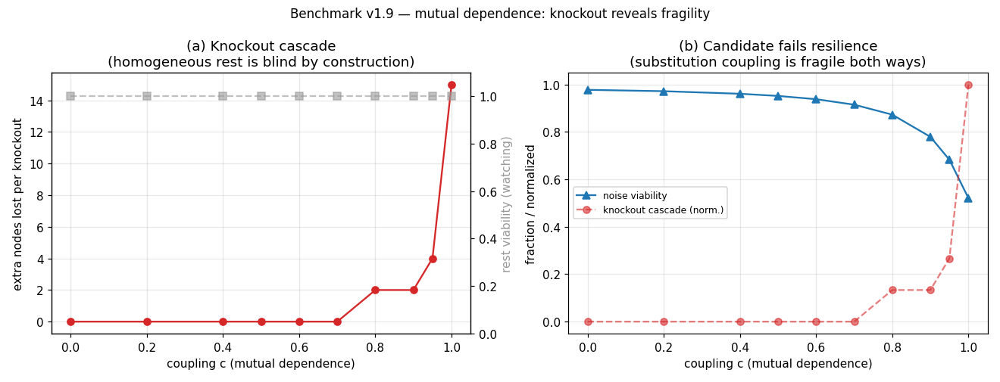
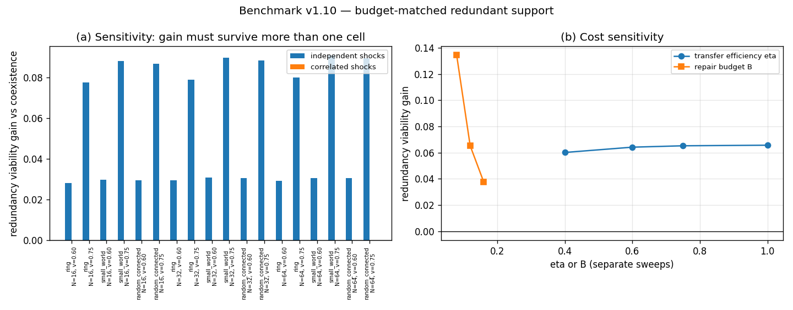
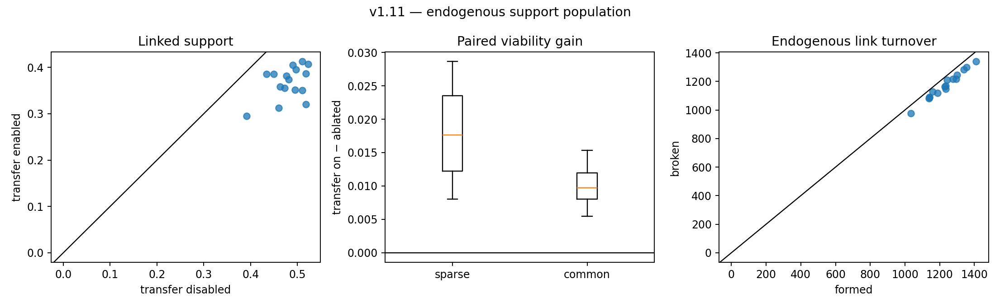

# Inverse-Reconstruction Benchmark (v0–v1.11) — Trace → Candidate Models

*Given a declared model family and a finite trace, which parameters, rules, or equivalence class can
be recovered—and how do noise, observability, interventions, and coverage change the answer?*

## Why this exists

The legacy [Generator Question](../../../theory/core/the-generator-question.md) proposed a universal
forward/inverse asymmetry. The [Foundations
Reconstruction](../../../theory/core/mathematical-axioms.md) withdrew that claim. This benchmark is
the empirical correction: it separates parameter fitting, family search, noise, partial
observability, coverage, and intervention rather than assigning one hardness label to all of them.

## The three testbeds

Each testbed reuses one of the repo's specified process models. In all three, the **model family is known** to the reconstructor—it lacks only parameters or rule bits. This is deliberately the standard *system-identification / SINDy* setting (Ljung 1999; Brunton, Proctor & Kutz 2016).

| Testbed | Process model | Inverse method | Dials |
|---|---|---|---|
| **Kuramoto** | mean-field ODE, $\dot\theta_i = \omega_i + Kr\sin(\psi-\theta_i)$ | finite-difference $\dot\theta$, least squares on the known library $\{1,\, r\sin(\psi-\theta_i)\}$ → all $\omega_i$ and shared $K$ | angle noise; **observed fraction** (mean field then computed from the observed subset only — a biased field) |
| **Elementary CA** | one of the 256 Wolfram rules on a ring | tabulate neighborhood → successor, majority vote | bit-flip noise; **IC entropy** (a single-seed IC may never exercise some neighborhoods) |
| **Boids** | cohesion/alignment/separation with weights $(w_c, w_a, w_s)$ | velocities + accelerations by differencing **noisy positions**, features recomputed from the noisy state, least squares | position noise (double differencing amplifies it by $\sim 1/dt^2$) |

## Results (v0, seeds averaged)

```
KURAMOTO  — rel. error on K
  vs noise (full obs.):   σ=0: 0.0%   σ=0.03: 0.5%   σ=0.1: 5.2%   σ=0.3: 27%
  vs observed fraction:   f=1: 0.5%   f=0.6: 13%     f=0.3: 21%    f=0.15: 41%
CA        — rule-bit accuracy (observed bits), random IC
  p=0 … 0.2: 100%   p=0.3: 93%      (majority vote is noise-robust)
  single-seed IC:  rule 110: 8/8 seen → class 1;  rule 30: 8/8 → class 1
                   rule 90:  5/8 seen → consistent-model CLASS SIZE 8
BOIDS     — rel. error on (w_c, w_a, w_s) from positions only
  σ=0: 3%   σ=0.003: 35%   σ=0.01: 226%   σ=0.03: 789%
```


## The honest finding

**With a known family, full observability and clean data, inversion is cheap** — exact rule tables, sub-percent parameter errors. The benchmark therefore does *not* support a uniform "inverse is hard" reading. What it supports — measurably — is where hardness actually lives:

1. **Noise × differentiation** (Boids): observing *state* instead of derivatives means differencing, and differencing amplifies noise; recovery degrades from 3% to ~800% error within $\sigma = 0.03$.
2. **Partial observability** (Kuramoto): an unobserved part of the system biases the reconstructed mean field; error grows monotonically as coverage shrinks.
3. **Coverage / identifiability** (CA): a low-entropy trace may never exercise parts of the rule. Rule 90 from a single seed exposes only 5/8 neighborhoods—the remaining 3 bits are unidentifiable **within this evidence and model family**, leaving a consistent-model equivalence class of size $2^3 = 8$. No estimator using only that trace can select one member without an additional assumption.
4. **Family search** (not in v0): when the model class is not supplied, program induction or symbolic regression must search a declared representation language. Its cost depends on that language, search procedure, target, and resource measure.

None of these results establishes an NP-hardness claim. The benchmark measures finite search and
identification problems; it does not use P $\ne$ NP as a project foundation.

## v1, part 1 — the intervention experiment (run)

[`intervention_experiment.py`](intervention_experiment.py) asks whether a consistent-model
equivalence class shrinks when passive observation is supplemented by declared interventions. The
observer chooses states and measures the specified process response. Results:

- **CA (rule 90, single-seed start, class 8):** *passive* observation plateaus at class 8 **forever** — the orbit's neighborhood distribution is exhausted, more watching buys nothing. *One-bit flips* collapse the class within ~10 queries. A single *prepared state* (a de Bruijn row containing every neighborhood) collapses it to 1 **in one step**. The hierarchy is strict: watching < perturbing < preparing.
- **The frozen exception (rule 0, class 16):** on a dead background, a one-bit flip only produces the four neighborhoods already known — *single-bit interventions never collapse the class*. Only the prepared state does. **The deader the dynamics, the more structure the query itself must supply** — if the system's own dynamics carry no information, the experimenter's design must. (In TEO terms: a frozen system, $H \to 0$, is also epistemically opaque.)
- **Kuramoto on its locked attractor:** within the fitted family, the passive synchronized trace does
  not separately identify $K$ and the $\omega_i$. Every $K'$ can be paired with an $\omega_i'$ that
  reproduces the locked trace. Measured: passive error on $K$ ≈ 83% (noise-fitting); **one phase
  kick: 3%**; eight kicks: 0.3%.

**Reading.** A passive attractor trace can leave parameters or rule bits observationally
equivalent. An intervention changes the evidence distribution and can separate members of that
declared class. This supports perturbation as a method in these testbeds; it does not by itself
validate the repository's identity instruments or establish a general hierarchy for every causal
system.

**Scope.** The interventions are available because the simulated causal interface is known. In
physical, biological, or social systems, observational conditioning and causal intervention must
not be conflated, and the available intervention set has to be justified independently.

## v1, part 2 — family search: the wall, measured (run)

[`family_search.py`](family_search.py) removes the supplied elementary-rule table and searches a
declared DSL of Boolean formulas over the CA neighborhood (NOT/AND/OR/XOR over $l,c,r$). Every one
of the 256 rules has an exactly computable minimal description size in this finite DSL. This is
language-relative description length, not general Kolmogorov complexity.

- **(A) The enumeration cost.** Verifying a candidate costs 8 bit-comparisons. This particular
  size-ordered enumerator visits exponentially more formulas as target description size grows:
  rule 90 (size 3) appears within ≤36 candidates; rule 30 (size 5) within ≤771; rule 110 (size 8)
  within ≤116,232; size-10 targets within ≤4.2M. That is a measured property of this DSL and
  enumerator, not a P-vs-NP result or a lower bound for other search algorithms.
- **(B) Elegance as a prior — and whom it serves.** Under partial coverage the searcher returns the *minimal consistent* formula (Occam). Measured: over **simple** targets (size ≤ 4) Occam hits 22%→100% as coverage grows; over a **uniform** world (all 256 rules) it equals 1/class-size — *exactly chance*; over **complex** targets (size ≥ 7) it sits at **0%** until coverage is nearly total, because it deterministically picks the simple impostor. Elegance finds elegant worlds, is chance on uniform ones, and systematically misses complex ones. For rules 90 and 0, the most elegant consistent rule happens to be the true one.

This refines the claim in [Construction vs. Deduction](../../../theory/computation/construction-vs-deduction.md) that elegance "does real work" as the selection principle inside the equivalence class: it does — *conditional on the world being biased toward simplicity*. The measurement says precisely when the condition holds. **Honest scope:** this is the exhaustive-search *floor*. Whether learned searchers (LLMs, program synthesizers) beat the enumeration floor — and whether they are construction machines or deduction machines — is the open real-model question; this testbed is the baseline they must beat.

## v1.3 — model exploitation: the world-models bridge (run)

[`model_exploitation.py`](model_exploitation.py) answers the question flagged in [World Models and VLA](../../../theory/ai/world-models-and-vla.md): **does model exploitation track equivalence-class size?** Setup: the agent's world model is a CA rule table with $u$ neighborhoods never observed (class size exactly $2^u$), filled with a fixed guess — *one class member, treated as fact*. The agent plans (argmax over 150 candidate interventions, imagined under its model) and executes in reality.

- **The selection decomposition.** Across *all* candidates, the gap (imagined − real) averages ≈ 0 at every $u$ — the guesses are wrong but **unbiased**. The **chosen** plan's gap is positive, and the wedge between the two curves — the **optimizer's curse** (Smith & Winkler, 2006), isolated — grows **monotonically** with class size: $0 \to 0.042 \to 0.049 \to 0.066 \to 0.078 \to 0.085$. Model exploitation is the equivalence class, priced by an argmax. At $u = 0$ both gaps vanish by construction: the model *is* the world.
- **The honest null (a prediction revised mid-experiment).** Run 1 predicted "divergence-seeking" — that the chosen plan would *visit* unseen neighborhoods more than the average candidate. **It does not**: usage is statistically identical at every $u$. The refinement matters: the optimizer does not steer *into* the model's fantasy regions; at equal exposure it *selects the fantasies that pay*. Exploitation is selection over guess-outcomes, not navigation toward guess-territory — in this open-loop setting; whether closed-loop agents learn to navigate toward exploitable regions is open.

**Hypothesis for larger systems:** this toy suggests that uncertainty-blind planning can acquire a
positive imagined-vs-real gap through selection even when candidate errors average to zero. Whether
the scaling survives different model classes, correlated errors, learned policies, and closed-loop
data is an empirical question.

## v1.4 — weakness vs simplicity: the Bennett bridge (run)

[`weakness_selector.py`](weakness_selector.py) tests the selector principle of Bennett's Stack Theory
on the CA rule family. Under partial coverage, the **weakest consistent hypothesis** is the partial
rule asserting exactly the observed neighborhoods—the uncollapsed equivalence class itself. The
shortest is v1.2's Occam pick. The experiment prices uncertainty held open against the odds paid by
committing to one member.

- **The exchange rate between the currencies is the world bias, measured.** Efficiency: **+2.7 → +1.0** on the simple world (committing is profitable compression); **0.00 ± 0.03** on the uniform world — the analytic prediction (hit = $2^{-u}$, so committing buys *exactly nothing*) confirmed to two decimals; **strongly negative** on the complex world (Laplace-floored below −7 with zero measured hits at $k \le 5$; −3.7 / −1.2 at $k = 6/7$).
- **Worse than a coin, systematically.** On the complex world the elegant guess loses to admitted ignorance at every coverage (1.28 vs 1.00 wrong unseen bits at $k=6$; 0.78 vs 0.49 at $k=7$) — anti-correlated with complex truths, not merely uninformed. And at $k \le 5$ the pick lies **outside the world's support 100% of the time**: elegance there does not miss, it asserts rules the sampled world cannot contain.
- **Reading.** Holding the class has 0 regret by construction; the measured content is the size and sign of the commitment gaps plus the support-violation rate. This closes a loop with v1.3: the exploiting planner consumes committed-but-unmarked guesses, while wmax refuses that commitment at selection time.


## v1.5 — marking the guesses: the cure, measured (run)

[`wmax_planner.py`](wmax_planner.py) closes the v1.3/v1.4 pair: what happens when **the planner itself holds the class** — when the guessed bits are marked as guesses at planning time? Four planners on the *same* episodes (paired): **committed** (v1.3's baseline, guess as fact), **wmean** (score = class-average imagined reward — the ensemble cure, exact), **wmin** (score = class-minimum — the pessimism cure, exact; corridor-flavored: viability, not optimality), **oracle** (true rule, reference). One vectorized rollout per candidate over all $2^u$ members yields every score *and* the real outcome, since the truth is a class member.

- **Within the declared uniform class, the wedge is the unmarked commitment.** Committed replicates
  v1.3 exactly. The exact class mean has a statistically zero wedge at every $u$ (.002–.005 ± .003).
  This follows from the uniform-class setup; it is not a theorem about arbitrary uncertainty
  representations.
- **And it pays:** wmean's real-reward regret vs the oracle is **35–60% below** committed's at every $u > 0$ (.014 vs .035 at $u{=}1$; .055 vs .073 at $u{=}5$). Marking guesses is not just epistemically honest — it wins in achieved reward, as Bayes-optimality says it must; the measurement is the size.
- **The surprise is the pessimist.** wmin is never disappointed (chosen gap $\le 0$ pointwise, down to $-0.30$ at $u{=}5$ — by construction, the truth is in the class) but pays for it in reality: **more regret than the committed gambler** from $u \ge 3$ (.070 vs .057; .080 vs .073 at $u{=}5$). In this setting, guaranteed-never-overpromising costs more real reward than delusional optimism. For the corridor vocabulary that is a sharp note-to-self: worst-case discipline is a *safety* instrument, and it is not free — matching model-based RL's folklore that overdone pessimism underperforms.
- **Honest scope:** open-loop toy, exact enumerable class. Industrially the class is *not* enumerable — ensembles approximate wmean, pessimism penalties approximate wmin — which is why "mark what the traces actually determine" ([Measurement as Weak Intervention](../../../theory/core/measurement-as-weak-intervention.md)) is an architecture requirement, not a free lunch.


## v1.6 — acting is measuring: the closed loop (run)

[`closed_loop.py`](closed_loop.py) closes the loop the open-loop pair left open: agents that replan over $H$ rounds on a persistent world, where **every executed plan is an intervention whether intended or not** — execution drives the world through neighborhoods, and reality answers with their true bits. The measurement note's regime hierarchy, running by itself. Agents: oracle, frozen-committed (v1.3 forever), updating-committed, updating-wmean, and a random-policy baseline; updating agents harvest what execution reveals.

- **In dense worlds, acting measures everything at once.** At the original settings one executed plan exercises all 8 neighborhoods almost surely: $u\!:\ 5 \to 0$ in a single round for every updating agent. The frozen agent's gap persists at v1.3 levels round after round; the updating agents' gap is zero from round 2 on. Cumulative regret orders exactly as predicted: wmean (.11) < committed (.20) < frozen (.84) < random (1.12).
- **The risky prediction died, honestly.** P3 predicted the curse funds its own cure — that the argmax, preferring plans that lean on flattering guesses, would collapse the class *faster* than a random policy. **Falsified** (in the sparse regime built to resolve it): the argmax collapses the class marginally *slower* than random flailing (residual $u$ after 16 rounds: 0.26 vs 0.18). Optimization is not curiosity — the argmax settles into reward-good orbits that re-use known neighborhoods. v1.3's null (selection, not navigation) extends to the closed loop and gains an anti-exploration corollary.
- **Two endogenous echoes:** a residual $u \approx 0.2$ persists for every agent — neighborhoods the dynamics never produce, v1.1's frozen exception appearing on its own (only a prepared state would reveal them). And the random agent finishes with the *best model and the worst reward* (regret 1.12): free measurement without optimization is not a strategy either.


## v1.7 — how much class does the cure need? (run)

[`ensemble_size.py`](ensemble_size.py) measures the honest toy version of the industrial gap: the class is not enumerable in practice — an ensemble holds $K$ sampled hypotheses, not $2^u$. At $u = 5$ (class $N = 32$), the planner scores by the mean of $K$ distinct sampled members; $K{=}1$ is a committed planner, $K{=}32$ recovers v1.5's exact wmean. Same episodes for every $K$, perfectly paired.

- **Honesty is cheap:** the curse wedge dies early and monotonically — $.082 \to .059 \to .040 \to .031 \to .011 \to .006$; **52% of the wedge is gone by $K{=}4$**, 87% by $K{=}16$. A handful of hypotheses buys most of the self-deception away.
- **Knowledge is not:** real-reward regret falls only modestly ($.073 \to .057$, endpoints matching v1.5's committed/wmean values — another cross-check). The floor is genuine ignorance, and no ensemble size removes it: **ensembles cure delusion, not ignorance; only queries (v1.1, v1.6) cure ignorance.**
- **Honest scope:** uniform sampling from an exact class is the ensemble's *best case* — real ensembles are correlated (shared architecture, shared data) and buy less variance reduction. These curves are the upper bound on $K$-member honesty.


## v1.8 — coupled processes: detecting family misspecification (run)

[`composition.py`](composition.py) couples two elementary CAs through XOR at a fixed random site
mask of density $g$. The observer sees one stream and asks whether any single elementary rule is
consistent. If the same 3-cell pattern has two observed successors, the single-rule class is empty.
That is a certificate of **model-family misspecification**, not an ontological proof that the process
"lives above" the family.

- **Misspecification is detected quickly when coupling affects the observed channel:** for rules 110
  and 30, one live coupled site empties the single-rule class within a median 1 step at every
  $g\ge0.02$.
- **Coupling can remain observationally invisible:** rule 90 does not read the center bit, so the
  chosen center-bit coupling leaves its observed transition table unchanged at every density.
  A second process that quickly dies can still leave a transient signature.
- **Changing the family restores fit:** when the coupled-pair family and mask are supplied,
  tabulation recovers every exercised rule bit exactly. The benchmark thereby measures the cost of
  moving from one declared model family to another; it does not discover a unique hidden mechanism.

This is a pair with a fixed mask, not an ecology: nothing here composes spontaneously, persists differentially, or is selected. The population version is v1.9 below.


## v1.9 — mutual dependence under knockout: a first co-stabilization candidate fails resilience (run)

[`co_stabilization.py`](co_stabilization.py) tests the first candidate model proposed for co-stabilization: $N=16$ health nodes on a fixed ring, with coupling $c$ **substituting** for self-sufficiency through $s=1-c$. The all-healthy state is a fixed point for every $c$ by construction. Three probes were preregistered: homogeneous rest, single-node knockout, and i.i.d. noise.

- **The constructed rest state is blind** (P1): viability is $1.00$ for every $c$. This establishes that the homogeneous fixed point contains no information about the dependency dial in this setup. It does not show that co-stabilization generally has no passive signature.
- **Knockout exposes super-additive dependency** (P2): extra losses first appear between the sampled $c=0.7$ and $c=0.8$, rise in finite steps, and reach the whole ring at the boundary $c=1.0$, where self-sufficiency is exactly zero. The cascade measures dependency under this rule; it is not by itself evidence of ecological self-maintenance.
- **The predicted robustness trade is falsified** (P3): noise viability falls from $0.977$ to $0.521$ as coupling rises. Because mutual dependence replaces rather than supplements self-sufficiency, the model becomes fragile to both targeted removal and distributed noise.
- **No phase transition is established** (P4): the apparent onset depends on the viability cutoff, topology, finite $N$, and coarse coupling grid. Scaling and sensitivity analysis would be required before calling it a critical coupling.

The useful result is negative and narrowing: **substitutive interdependence is not yet co-stabilization**. It produces a monoculture-like dependency pattern while failing the resilience criterion that motivated the ecology reading. Co-stabilization therefore remains `[HYPOTHESIZED]`. The next discriminating model must retain self-sufficiency and add redundant coupling; the population version remains one level further out.



## v1.10 — redundant mutual support under a matched budget (run)

[`co_stabilization_redundancy.py`](co_stabilization_redundancy.py) follows the v1.9 boundary result with the discriminating counterfactual it demanded. Every active node has the same repair budget `B`. **Coexistence** spends it locally; **substitution** reserves a fixed share for neighbors and thereby reduces local capacity; **redundancy** preserves local priority and routes only otherwise-unused capacity. Transfer is lossy, total draw is audited against `N × B`, and every architecture sees the same shock traces. The preregistered candidate criterion asks whether redundancy beats matched coexistence under sparse shocks across size, topology, viability threshold, transfer efficiency, and repair-budget sweeps; knockout dependency and common-mode shocks are reported separately.

Headline case: `N = 32`, small-world graph, threshold `0.70`, 20 seeds.

| Architecture | Independent viability | Correlated viability | KO-1 cost | KO-2 cost | Local recovery |
|---|---:|---:|---:|---:|---:|
| coexistence | 0.933 | 0.992 | 0.000 | 0.000 | 7.0 steps |
| substitution | 0.993 | 0.981 | 0.003 | 0.005 | 5.5 steps |
| redundancy | **0.999** | 0.992 | 0.000 | 0.001 | **4.6 steps** |

- **The candidate criterion is supported, narrowly.** Redundancy beats coexistence in **100% of 18** size/topology/threshold cells; median independent-shock gain is `+0.0543`, with maximum budget ratio exactly `1.000000`. Setting transfer efficiency to zero makes redundancy identical to coexistence, so the gain is causally attributable to the routed spare capacity.
- **The common-mode limit is sharp.** Median gain under correlated shocks is `+0.0000`: when all nodes are damaged together, there are no healthy donors with spare capacity.
- **One preregistered prediction is falsified.** Substitution also beats coexistence under independent shocks in every cell. Pooling alone helps when damage is sparse. Its cost appears under common-mode damage and knockout; the post-run diagnostic still has redundancy beating substitution in every cell, median `+0.0129`.
- **The result is not a parameter-point artifact.** Redundancy gain stays positive for transfer efficiency `0.40–1.00` (`+0.0602` to `+0.0657`) and `B ∈ {0.08, 0.12, 0.16}` (`+0.1343`, `+0.0652`, `+0.0377`).

This operationalizes one **designed, budget-matched mechanism of functional mutual support**: healthy nodes' spare capacity improves collective viability under sparse shocks without requiring keystone fragility. It does **not** establish spontaneous ecology, metabolism, life, or a general self-maintenance threshold. The next level is endogenous: populations must build, retain, and dissolve the coupling structure rather than receive it from the experimenter.



## v1.11 — useful support is not yet evolutionarily stable (run)

[`co_stabilization_population.py`](co_stabilization_population.py) removes v1.10's supplied support graph. Individuals occupy a 12 × 12 toroidal lattice, receive environmental resources, suffer shocks, die, reproduce locally, and mutate. Support propensity and link propensity are inherited. Realized links form and break during the run; every link, transfer, self-repair, and birth is paid from stored energy. Low-contributing recipients are allowed, and there is no explicit fitness or group reward. The potential neighborhood remains spatially constrained, but the occupied population and realized support graph are endogenous.

The preregistered candidate criterion required three things: valid accounting, more linked support retained under transfer-enabled evolution than in a matched transfer-disabled control in a majority of seeds, and a positive paired sparse-shock assay after evolution. The first and third hold. The selection condition fails decisively.

| Median over 16 seeds | Transfers enabled | Transfers disabled |
|---|---:|---:|
| late population abundance | 104.1 | **125.6** |
| linked support propensity | 0.378 | **0.486** |
| realized link density | 0.485 | 0.489 |

- **The network is dynamically produced.** Median turnover is 1,236 links formed and 1,168 broken, with 96 births and 96 deaths. Maximum transfer draw / unused repair capacity is `1.000000`; stored energy never becomes negative.
- **The network is functionally useful.** In paired post-evolution sparse-pulse assays, enabling the exact evolved transfers adds `+0.0089` survivors, `+0.0176` integrated viability, and a 2-step recovery advantage over ablating transfer.
- **But contribution is selected downward.** Transfer-enabled populations retain less linked support in **all 16 seeds**: median difference `−0.1061`, with a `−0.1221` change from the initial level. They also sustain fewer individuals. The support mechanism helps the present collective but costs its contributors enough that local survival and reproduction do not preserve it.
- **The common-mode boundary is partial.** Common damage yields no median survivor gain and only `+0.0097` integrated viability, below the sparse result; its recovery-time summary nevertheless improves by 3 rather than 2 steps. The limit is not universal across metrics.
- **Low contributors persist.** `40.4%` of linked agents finish below support `0.20`; `17.6%` combine that low contribution with link propensity above `0.50`.

The preregistered endogenous co-stabilization criterion is therefore **not supported**. v1.11 exposes the missing bridge between a mechanism that benefits a collective and one that evolution actually retains. The next discriminating models are not “more support” but mechanisms that can alter that selection problem: partner choice, conditional reciprocity, and spatial/kin assortment. Resource production and open-ended topology remain external beyond that.



## Running

```bash
python inverse_benchmark.py              # v0: console summary, three testbeds (~10 s)
python inverse_benchmark.py --save       # also write the v0 figure (to lab/tools/)
python intervention_experiment.py        # v1.1: interventions vs. observation (~5 s)
python intervention_experiment.py --save # also write the intervention figure
python family_search.py                  # v1.2: the family-search wall (~1 s)
python family_search.py --save           # also write the family-search figure
python model_exploitation.py             # v1.3: exploitation vs class size (~2 min)
python model_exploitation.py --save      # also write the exploitation figure
python weakness_selector.py              # v1.4: weakness vs simplicity (~3 s)
python weakness_selector.py --save       # also write the weakness figure
python wmax_planner.py                   # v1.5: marking the guesses (~40 s)
python wmax_planner.py --save            # also write the wmax-planner figure
python closed_loop.py                    # v1.6: the closed loop (~30 s)
python closed_loop.py --save             # also write the closed-loop figure
python ensemble_size.py                  # v1.7: ensemble size vs the curse (~9 s)
python ensemble_size.py --save           # also write the ensemble figure
python composition.py                    # v1.8: composition, the empty class (~15 s)
python composition.py --save             # also write the composition figure
python co_stabilization.py               # v1.9: co-stabilization, the knockout (~5 s)
python co_stabilization.py --save        # also write the co-stabilization figure
python co_stabilization_redundancy.py      # v1.10: matched-budget redundancy (~25 s)
python co_stabilization_redundancy.py --save # also write the redundancy figure
python co_stabilization_population.py      # v1.11: endogenous population (~7 s)
python co_stabilization_population.py --save # also write the population figure
```

Requires `numpy`, `matplotlib` only (repo `requirements.txt`).

## Current roadmap (open)

*(The benchmark sequence through v1.11 is run and documented above. The items below remain open.)*

- **From useful support to stable support**: v1.11 lets links turn over, traits mutate, and individuals reproduce, but paid contribution is selected downward despite a positive acute ablation test. Next: compare **partner choice**, **conditional reciprocity**, and **spatial/kin assortment** under the same accounting and cheater controls. Only after one survives invasion and ablation should resource production and less constrained topology be added.
- **Learned searchers vs. the enumerator**: family_search.py measures one exhaustive search. Compare learned and symbolic searchers on the same DSL, targets, compute budget, and held-out interventions rather than assuming either has a generic advantage.
- **Re-simulation divergence** as a behavioral metric: does a recovered candidate process model match held-out trajectories and interventions even when its parameters differ?
- **IFS testbed**: recover contractive affine maps from an attractor point cloud (hard even with known family — no time ordering).
- Cross-method comparison: hand-rolled least squares (v0) vs. SINDy/PySR as external baselines (would add dependencies; deliberately out of v0).

## Related

- [The Generator Question](../../../theory/core/the-generator-question.md) — the superseded spine that motivated the benchmark; retained as audit history.
- [Measurement as Weak Intervention](../../../theory/core/measurement-as-weak-intervention.md) — the conceptual hinge on v1.1's hierarchy: coupling is not identification; plus the fourth (reflexive) regime the toys cannot exhibit.
- [Open Problems](../../../theory/reference/open-problems.md) — Open Problem 11 (bounded inverse reconstruction).
- [Related Work Map](../../../meta/research-alignment/related-work-map.md) — SINDy / system identification / program induction anchors.
- [`lab/experiments/trace_to_generator/`](../../experiments/trace_to_generator/README.md) — the earlier inverse-prompting scaffold.
