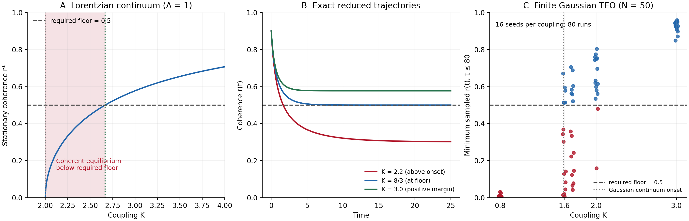

# Synchronization Onset Is Not a Viability Margin

**Status:** Completed bounded model check, 2026-09-07; predictions committed
before numerical execution. This page reviews the coherence premise of Conjecture 1 in
[The Viable Corridor](../../../papers/viable-corridor.md#34-conjecture-1-sufficiency).
It does not revise the frozen v1.0 manuscript or its results.

**Result:** Synchronization onset is too weak to guarantee a declared positive
coherence floor. In the Lorentzian scalar reduction, the exact floor condition
is `K >= 2*Delta/(1-r_min^2)`, strictly stronger than onset. In the unchanged
finite Gaussian TEO model, **21 of 64 above-onset runs** violate the floor
while resources and substrate stay safe over the observation interval. These
finite runs are witnesses, not a proof about every possible initial condition.



The shaded interval in panel A has a positive equilibrium below the required
floor. Panel B separates onset, zero limiting margin, and positive limiting
margin. Panel C shows every finite run's sampled minimum; small horizontal
offsets separate seeds at the five declared couplings. The two distributions
have different onset thresholds and must not be read as the same system.

## Measured results

All 45 scalar integrations agree with the closed-form solution to a maximum
absolute error of `1.06e-11`. Lorentzian quadrature agrees with the exact
threshold to `6.04e-14`. Independent quadrature of the Gaussian stationary
branch gives:

| Required coherence | Lorentzian floor, `Delta = 1` | Gaussian stationary floor, `sigma = 1` |
|---|---:|---:|
| 0.25 | 2.133333 | 1.628843 |
| 0.50 | 2.666667 | 1.747903 |
| 0.75 | 4.571429 | 2.070711 |

The respective onset thresholds are `2` and `1.595769`. The Gaussian column
specifies a stationary branch, not an all-time finite-population bound.

The full finite TEO grid used `N = 50`, `r_min = 0.5`, seeds `0..15`, and
`t = 0..80`. Every trajectory started above the floor. All solvers completed;
every cell passed the numerical validity checks and kept the other two
viability conditions over the observation interval.

| Coupling `K` | Runs | Coherence-floor failures | Relation to Gaussian continuum onset |
|---|---:|---:|---|
| 0.8 | 16 | 16 | Below |
| 1.6 | 16 | 10 | Above |
| 1.7 | 16 | 9 | Above |
| 2.0 | 16 | 2 | Above |
| 3.0 | 16 | 0 | Above |

These are counts in the declared grid, not estimated failure probabilities.
The two failures at `K = 2.0`, already above the Gaussian stationary floor,
also show why substituting a continuum equilibrium threshold into a finite
trajectory classifier would be unsound.

The preselected validation pair is seed `0` at `K = 1.6` and `K = 3.0`.
The former first crosses the floor near `t = 5.150262`, with sampled minimum
`r = 0.343711`; the latter remains above `0.943024`. Tightening the integration
keeps both classifications unchanged. The largest change in their sampled
minimum is `5.32e-9`, and in final coherence `2.26e-8`.

All 80 cells, the 45 scalar checks, frequency draws, parameters, software
versions and both validation reruns are in [results.json](results/results.json).
The [vector figure](results/coherence_margin.svg) is generated from those
results and the displayed exact solution.

## Consequence for the conjecture

The coherence condition in §3.4 needs a separate floor-dependent analysis,
just as its resource condition already distinguishes any regulation from
sufficient regulation. In the declared Lorentzian reduction, the stronger
condition is exact; requiring a positive limiting margin makes it strict.
In broader settings the appropriate condition must control a viable
neighborhood under the actual phase dynamics, including transients and
frequency-distribution assumptions. The Gaussian stationary calculation
alone does not supply that condition.

This is a concrete revision target for the pending dynamical-systems review.
The old onset inequality can remain a necessary condition within its stated
scope, but cannot carry the stronger sufficiency interpretation in this
reduced case. Nothing here proves sufficiency of the entire coupled TEO
model, changes the frozen capability-loading measurements, or establishes
a statement about real agent ecologies.

The design and predictions below were committed before numerical execution;
they are retained so the result can be compared with what was actually asked.

## Question

The paper requires a fixed coherence floor `r(t) >= r_min > 0`, but its
sufficiency conjecture asks only for `K > K_c` on the coherence axis.
Synchronization onset establishes the existence of a positive coherent branch.
Does it establish enough coherence to meet the declared floor?

This is a narrower question than proving the whole corridor sufficient. It
comes from reading the paper against its own definitions, not from adding a
new physical mechanism. The existing Gaussian, finite-population simulations
and the Lorentzian continuum calculation below answer different questions and
are reported separately.

## Analytical setting and prediction

Take all-to-all sinusoidal coupling, an infinite population with Lorentzian
frequency density of half-width `Delta > 0`, and constant full substrate health
`H = 1`. On the Ott–Antonsen manifold, the order-parameter amplitude obeys

$$
\dot r = r\left[\frac K2(1-r^2)-\Delta\right].
$$

This is the established reduction of Ott and Antonsen
([2008, §III, Eq. 10](https://arxiv.org/html/0806.0004v1#S3)), with the
frequency width restored. Its positive equilibrium is

$$
r_* = \sqrt{1-\frac{2\Delta}{K}},\qquad K>K_c=2\Delta.
$$

Evaluating the vector field at the required floor gives

$$
\dot r\big|_{r=r_{\min}}\geq0
\quad\Longleftrightarrow\quad
K\geq K_{\mathrm{floor}}
:=\frac{2\Delta}{1-r_{\min}^2}.
$$

Consequently, for `0 < r_min < 1`:

- **Below `K_floor`:** the vector field is strictly negative everywhere on
  `[r_min, 1]`. Every reduced trajectory starting in that interval leaves it
  in finite time. This rules out an invariant open set there, not just the
  safety of one chosen trajectory.
- **At `K_floor`:** `[r_min, 1]` is forward invariant, but the limiting
  coherence margin is zero. This can meet the paper's deterministic open-set
  definition; it provides no positive tolerance to adverse parameter changes.
- **Above `K_floor`:** `[r_min, 1]` is forward invariant and the stable
  equilibrium lies strictly above the floor. This is a result about this
  scalar reduction, not a complete TEO sufficiency theorem.

For `Delta = 1` and `r_min = 0.5`, onset is `K_c = 2`, whereas
`K_floor = 8/3`. At `K = 2.2`, a positive equilibrium exists but
`r_* = sqrt(1/11) < 0.5`. We predict that every initially viable reduced
trajectory crosses the floor; stronger regulation cannot repair an independent
phase equation when `H = 1`.

The extension beyond the invariant manifold requires the regularity and
attraction assumptions of Ott and Antonsen
([2009, §§III–IV](https://arxiv.org/abs/0902.2773)). We do not infer a theorem
about arbitrary phase distributions, finite populations, networks, or noisy
oscillators from the scalar calculation.

## Independent numerical checks

1. Integrate the scalar vector field with `solve_ivp` and compare it with the
   logistic solution for `y = r^2`, derived directly from
   `dy/dt = (K - 2*Delta)*y - K*y^2`. Cover below onset, onset itself,
   onset-to-floor, the floor, and above-floor regimes. Use floors
   `{0.25, 0.5, 0.75}` and starting amplitudes
   `r_min + (1-r_min)*{0.1, 0.5, 0.9}`, at `Delta = 1`.
   The five couplings for each floor are
   `{0.9*K_c, K_c, 1.1*K_c, K_floor, 1.05*K_floor}`; these labels describe
   how couplings are chosen, not a guarantee that `1.1*K_c` lies below every
   floor. Integrate to `t = 80`. Report the maximum solution error and
   the vector field at the boundary.
2. Obtain the Gaussian coherent-branch coupling for `r_* = r_min` from the
   paper's own self-consistency equation (Appendix A.2), by quadrature and
   root finding at `sigma = 1`, for the same three floors. Check the same
   quadrature against the Lorentzian closed form. This is a stationary-branch
   calculation, not an all-time Gaussian invariance proof.
3. Reuse the unchanged canonical TEO right-hand side with its Gaussian
   frequencies and initial-condition procedure. Run `N = 50`, seeds `0..15`,
   couplings `{0.8, 1.6, 1.7, 2.0, 3.0}`, and all other paper defaults,
   through `t = 80`. These 80 declared trajectories are a numerical stress
   test, not a population estimate or proof about all initial conditions.
   Record all three viability conditions, minimum and final coherence,
   threshold crossings, simplex error, and solver completion. Report every
   cell, not only failures. The old figures and results are never overwritten.

The TEO grid prediction is that at least one trajectory with `K > K_c` violates
the coherence floor while remaining safe on resources and substrate. If none
does, report the null: the analytic Lorentzian result would still stand, but
there would be no corresponding finite Gaussian witness on this grid.
The `K = 0.8` and `K = 3.0` runs provide low- and high-coupling comparisons;
their outcomes are measured, not assumed to hold seed by seed.

For numerical validation, re-integrate the first above-onset coherence failure
in `(K, seed)` order, and the matched `K = 3.0` trajectory, with tighter
tolerances and halved maximum step. If no such failure exists, use the first
`K = 1.6` trajectory and its `K = 3.0` comparison. This selection rule is fixed
before the grid is run.

## Failure conditions and interpretation

- A closed-form versus numerical scalar error above `1e-7`, or a disagreement
  between Lorentzian quadrature and the closed-form threshold above `1e-7`,
  invalidates the numerical implementation until explained.
- An incomplete solver trajectory, nonfinite state, material simplex drift,
  or resource/substrate failure invalidates interpretation of that TEO cell
  as an isolated coherence witness.
- If the selected finite-grid witness changes classification when integration
  is tightened, it is not a robust numerical witness.
- A finite list of failed initial conditions cannot refute the paper's
  existential open-set definition. The all-initial-amplitudes obstruction
  above is what establishes the stronger statement inside the scalar setting.
- A stationary coherence threshold is not sufficient to control transients in
  a different distribution or finite system. No new universal threshold is
  proposed, and no inference to collective agency or consciousness follows.

The expected revision target is the sufficiency conjecture's coherence
condition: it must carry the chosen `r_min` and an appropriate dynamical scope.
The necessary onset condition and the frozen capability-loading and
hard-versus-soft-budget measurements are separate claims.

## Provenance

Read against repository base `ef9c5117aaf192c73eff71c587053157bae9334c` on
2026-09-07. The analytical prediction follows from the displayed equation;
it is not a blind prediction or a claim of new oscillator mathematics. No
numerical result of this investigation was inspected before this design was
committed as `2856729`. The runner was committed as `6b87646` before the first
execution. The output records that source commit, both source hashes,
parameters and package versions. The canonical TEO solver is unchanged from
the repository base.

These are **local execution-history commit IDs**. Publication to GitHub took
place afterwards through the connected app, which creates different commit
IDs. The published [design commit](https://github.com/frnkptrln/systems-and-intelligence/commit/89e5cea506cae64858d5da86dbc438105e6dcc4a)
and [runner commit](https://github.com/frnkptrln/systems-and-intelligence/commit/f59d5e0eb4fee6224aed3f9bb19e682897f27e80)
have exactly the same Git trees as their respective local originals.
The recorded SHA-256 hashes identify the executed source independently of
this publication step. This was a locally predeclared check, not a public or
blinded preregistration.

## Reproduce

From the repository root, with [requirements.txt](../../../requirements.txt)
installed:

```bash
python lab/experiments/coherence_margin/coherence_margin.py --output /tmp/coherence-margin
pytest tests/test_coherence_margin.py -q
```

The first command reruns the full declared grid and produces JSON, PNG and
SVG files. The tests check independent scalar integration, the quadrature
control, the committed grid headline and the selected finite witness against
the canonical simulator. Core conclusions should reproduce within the stated
tolerances; source-commit metadata changes when run from a later checkout.

## Related

- [Viable Corridor, §3.1](../../../papers/viable-corridor.md#31-the-viable-region-and-robust-viability)
  — the fixed coherence floor and open-set definition.
- [TEO simulation](../../../simulation-models/alignment-and-veto/teo-civilization/README.md)
  — canonical finite Gaussian model.
- [Decision-Relevant Identifiability](../../../theory/core/decision-relevant-identifiability.md)
  — a threshold is meaningful relative to the declared decision criterion.
