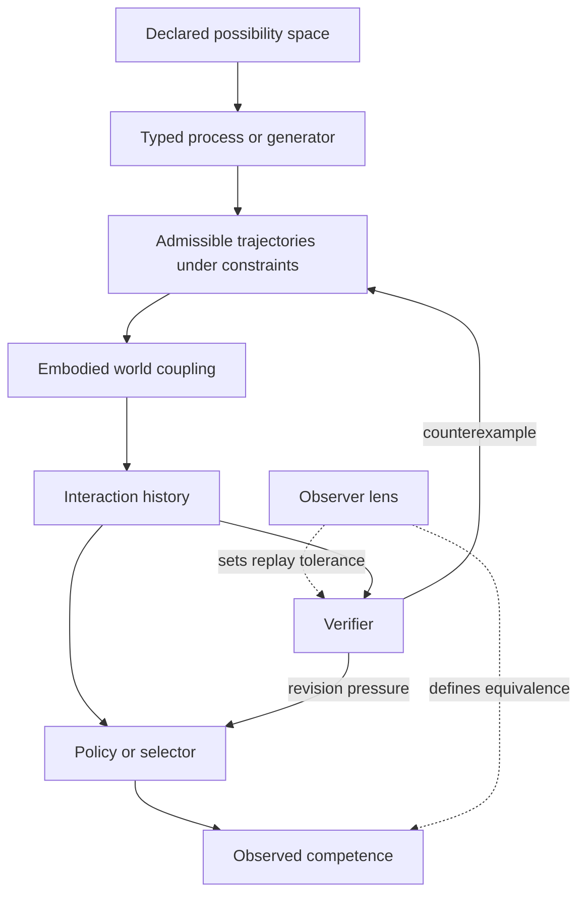
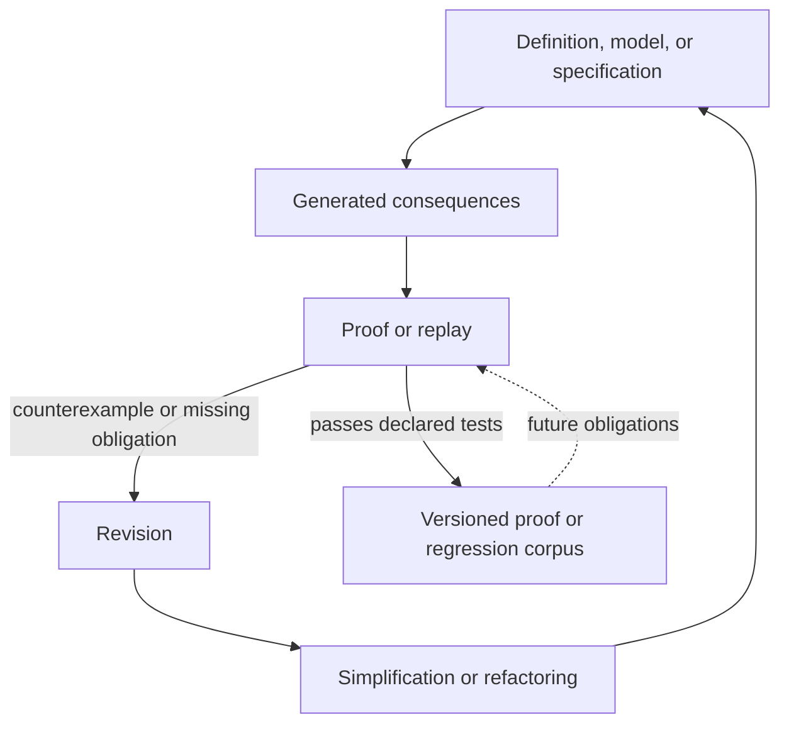

# Competence, Constraint, and Verification

**Status:** Working synthesis and research programme. Definitions are local to
this page unless linked to an existing foundation. Empirical claims are marked
and sourced; analogies are not identities.

**Question:** How should explanatory credit be divided when a large behavioral
capacity becomes visible after a small change in constraint, embodiment,
selector, interaction history, or verification protocol?

This page integrates the strongest source-verified threads prompted by AGI-26
Day 2. It is not a conference summary. The claim ledger and bibliographic
decisions are in the [Day 2 Source and Integration Map](../../meta/research-alignment/agi-26-day-2-source-map.md).

## 1. Audit result: the generator is not enough

An earlier version of this repository treated a generic “generator” as its
foundation. The [foundations audit](mathematical-axioms.md#6-the-generator-audit)
retired that move: a transition kernel, proposal process, program, policy, and
historical mechanism are different typed objects. A trace can constrain a
declared model family without uniquely recovering any of them.

The Day 2 material does not justify restoring the old foundation. It does
strengthen a narrower diagnosis:

> **Working thesis.** Expressed competence is a property of a declared process
> in a declared coupling, under constraints, history, tasks, tests, and an
> observer lens. A compact intervention can expose a large capacity without
> being the sole source of that capacity.

This is weaker than saying that intelligence already exists in every rich
substrate. It also resists the inverse error: attributing all competence to
learned weights or a central controller while treating the body, environment,
and evaluator as neutral plumbing.

## 2. Why the proposed seven-term equation needs revision

The intake hypothesis suggested
$\mathcal C_{\mathrm{obs}}=F(G,S,B,\Gamma,I,V,L)$. It is useful as an audit
checklist but not as a foundation:

1. $G$ has no type. A transition law, random feature map, developmental
   process, and hypothesis proposer cannot be exchanged without changing the
   claim.
2. $S$ is causally ambiguous. A learned adapter, action policy, experimental
   intervention, and observer projection do different work.
3. $I$ conflates interaction with the history retained from interaction.
4. $V$ already denotes viability constraints in the repository's situated
   stack; reusing it for verification would create a real notation conflict.
5. $L$ should usually **index** an equivalence or measurement, not appear as
   though it were another hidden causal component.
6. Verification is dynamic. A failed replay or proof can revise the process
   that produced the claim, so it is not adequately represented by one static
   input.

The existing situated system remains

$$
\Sigma=(P,B,E,C,O,A,M,V),
$$

where $P$ is an internal process, $B$ a body or substrate, $E$ an environment,
$C$ the coupling, $O$ observation operators, $A$ available actions, $M$
control-available memory, and $V$ viability constraints, goals, or
preferences. This tuple is bookkeeping, not an ontology.

For this programme, a more useful **diagnostic notation** is

$$
\mathsf{Cap}_{\ell,\tau}(\Sigma,\Gamma,H_t;\mathcal Q),
$$

where:

- $\Gamma$ is a declared admissibility condition on states, actions, or
  trajectories;
- $H_t$ is the interaction history available at time $t$;
- $\mathcal Q$ is a verifier or test protocol that can trigger revision;
- $\ell$ is the observer lens defining the reported equivalence; and
- $\tau$ is the task family.

The semicolon marks $\mathcal Q$ as a protocol acting on the process, not
necessarily a component outside it. If the verifier is implemented inside the
agent, it belongs in the relevant parts of $\Sigma$ as well. The notation is
not an established competence law and does not imply scalar-valued
intelligence.

## 3. The typed decomposition

**Possibility space.** A declared set of states, functions, structures, or
trajectories considered possible by a model. It is model-relative; it is not a
Platonic realm.

**Process or generator.** A typed map that proposes, produces, or indexes
elements of a possibility space. Examples include a transition kernel, grammar,
developmental process, random feature map, and theorem conjecturer. The word
“generator” adds no explanation until this type is supplied.

**Constraint.** A predicate, resource bound, boundary condition, or coupling
that removes, redirects, prices, or terminates trajectories. Constraints need
not merely subtract capacity: they can stabilize useful dynamics.

**Selector.** A causal mechanism that makes some possibilities more likely or
usable: a policy, adapter, gate, search procedure, or intervention. An observer
lens is not a selector unless it feeds back into the dynamics. A selector can
itself be generated, but that recursion does not erase its causal role at the
level being analyzed.

**Embodiment.** The action–observation–resource coupling supplied by $B,C,O,A$
and the relevant part of $E$. It changes reachability, cost, and what can be
learned from action.

**Interaction and history.** Interaction is the coupled event; $H_t$ is the
ordered record retained from such events. Equal current states with different
histories need not implement equal processes when adaptation, energy, damage,
or memory is path-dependent.

**Observer lens.** A declared map from traces to measurement outcomes or
equivalence classes. A lens can discover a stable regularity, miss one, or
manufacture an apparent score increase through coarse-graining.

**Verifier.** A procedure that compares a proposal with proof obligations,
held-out observations, replay history, or externally governed criteria. Its
output may be acceptance, a counterexample, an unresolved obligation, or a
request for more evidence.

**Invariant.** A represented quantity preserved under a declared
transformation family and equality notion. It can support a continuity claim
only relative to that declaration.

## 4. Situated competence is a feedback system

The first diagram separates causal access from observation. The lens determines
which trace differences count as competence and which differences replay must
preserve. The verifier can then exert reverse pressure on constraints and
selection.

The arrows are dependencies, not a claim that cognition always develops in
this order. In particular, selection and embodiment can alter the next
interaction, and constraints can be produced by prior interaction.

## 5. Latent competence as a relative, testable claim

Fix a process $P_X$, task family $\tau$, and lens $\ell$. Let

$$
\kappa_0=(B_0,E_0,C_0,O_0,A_0,\Gamma_0)
$$

be a reference coupling. Let
$\mathcal C(P_X,\kappa;\ell,\tau)$ be the set of capacities detected under that
declaration.

**Definition — latent competence.** A capacity $c$ is latent relative to
$\kappa_0$ and an admissible transformation family $\mathcal T$ when

$$
c\notin\mathcal C(P_X,\kappa_0;\ell,\tau)
$$

but there is a $T\in\mathcal T$ such that

$$
c\in\mathcal C(P_X,T\kappa_0;\ell,\tau),
$$

while $P_X$, $\ell$, and $\tau$ remain fixed.

This definition is intentionally reference-relative. It does not say the
capacity was never selected for historically, that no learning occurs during
the transformation, or that the process has a context-free essence.

Four cases must be separated:

| Case | Process trace | Process/coupling | Lens | Interpretation |
|:---|:---|:---|:---|:---|
| creation or import | changes | process acquires new operative structure | fixed | not latent under the fixed-process definition |
| amplification | graded behavior increases | parameters or coupling change | fixed | requires a noise and effect-size model |
| exposure | a previously blocked route is taken | process fixed; admissible constraint/coupling change | fixed | latent relative to the reference |
| reinterpretation | unchanged | unchanged | changed | measurement change, not behavioral exposure |

The exact [Constraint-Release Benchmark](../../lab/benchmarks/constraint-release/README.md)
implements exposure, reinterpretation, and a generator-edit control. One
constraint-bit release and one lens-rule edit both yield
$\Delta C_{\mathrm{obs}}=1$; only the release changes the physical traces.

Michael Levin and collaborators provide empirical examples in which biological
material behaves robustly under unusual configurations: ectopic eyes can
support light-mediated learning in tadpoles; Xenopus and human airway cells can
self-organize into motile biobots; and regenerative systems can restore
large-scale anatomy after perturbation. These observations support Level A:
competence can occur in configurations not directly optimized in their current
form. They are consistent with Level B: a substrate can support a wider
repertoire of reachable dynamics than its reference embodiment displays.
They do not establish Level C, the claim that patterns ingress from an
independent Platonic space.

The unresolved accounting question is therefore central:

> When a low-description intervention exposes a high-description behavior,
> how much explanatory cost belongs to the historical process, substrate
> geometry, environmental regularity, intervention, and lens?

Description length can discipline this question only after an encoding is
declared. There is no representation-independent conservation law that assigns
the cost uniquely.

## 6. Rich process, small selector: the LottaLoRA constraint

Hazan, Zhang, Hartl, and Levin's 2026 LottaLoRA preprint freezes seeded random
backbones and trains low-rank adapters. Across nine reported benchmarks, the
adapters recover 96–100% of the corresponding fully trained performance while
training 0.5–40% of parameters. These are relative benchmark results, not a
claim that noise contains every solution.

The paper's minimum-rank proposal should be made explicitly conditional. For
a task $T$, architecture $\mathcal A$, optimizer and budget $\mathcal O$,
dataset $D$, seed distribution $\mathcal S$, tolerance $\varepsilon$, and
reliability level $p$, define

$$
r^*_p(T,\mathcal A,\mathcal O,D,\varepsilon)=
\min\left\lbrace
r:
\Pr_{s\sim\mathcal S}\left[
\mathrm{Perf}(T,\mathcal A,\mathcal O,D,s,r)
\geq
\mathrm{Perf}_{\mathrm{full}}-\varepsilon
\right]\geq p
\right\rbrace.
$$

This is an empirical threshold relative to an evaluation and training
protocol. It is not Kolmogorov complexity, VC dimension, or an intrinsic task
property unless invariance across architectures, optimizers, budgets, data,
seeds, and metrics is separately shown. The paper itself reports that model
capacity can move the observed $r^*$.

Nearby quantities answer different questions:

| Quantity | Relationship to $r^*_p$ | Why it is not the same object |
|:---|:---|:---|
| intrinsic dimension / “task rank” | possible interpretation of a stable saturation threshold | requires stability across representations, architectures, optimizers, budgets, and seed ensembles |
| matrix effective rank | measures spectral concentration in a selected matrix or representation | depends on which matrix and threshold are inspected, not directly on task sufficiency |
| Kolmogorov complexity | prices the shortest task or solution description in a declared language | description length is not the number of trainable adapter directions |
| VC-style capacity | gives worst-case representational or sample-complexity bounds for a hypothesis class | does not identify the empirical rank sufficient for one data distribution and optimizer |
| information bottleneck | studies predictive information retained under a distribution and representation | mutual information can vary while algebraic adapter rank remains fixed |
| LoRA rank | the controlled algebraic rank of each trained update | this is the experimental knob from which $r^*_p$ is estimated, not an explanation by itself |
| random kitchen sinks / reservoir computing | fixed random features plus a learned readout are close precedents | LottaLoRA inserts learned low-rank paths through deep architectures; formal equivalence needs a declared unfolding and training rule |

Four explanations remain live:

| Explanation | What the paper supports | What remains unresolved |
|:---|:---|:---|
| random feature basis | a fixed random backbone is actively used and alternative fixed initializations work | whether the basis is efficient or merely overcomplete |
| lottery-like substructure | useful directions may exist in a large random system | no subnet selection mechanism is isolated |
| optimization geometry | low-rank parameterization changes the searchable update space | no matched loss-landscape causal study separates this effect |
| implicit regularization | restricting trainable directions may protect generalization | regularization is not isolated from capacity and optimization |

The inverse interpretation is also compatible with the evidence: the random
backbone may be an inefficient basis while the adapter and task head carry the
operative task information. The result strengthens a **selector audit**, not a
metaphysics of noise.

## 7. Interaction can ground a functional semantics

In a representational observation model,

$$
o_t=O(s_t),
$$

the observation is indexed by world state. In an enactive interaction model,

$$
i_t=I(a_t,s_t,s_{t+1}),
$$

the event includes what the agent attempted and the feedback that followed.
Georgeon, Marrel, and Cook's AGI-26 paper reports a small schema-learning
experiment over such sensorimotor-loop tokens. The reported evidence concerns
learned sequence roles and attention structure, not a general theory of
meaning.

The focused note [Interaction-Grounded Semantics](../ai/interaction-grounded-semantics.md)
defines a conservative claim:

> A token's functional meaning is its stable, policy- and probe-relative role
> in families of interaction histories.

This can preserve future predictions, available policies, action affordances,
or valence—provided the relevant tests are named. It connects semantics to the
repository's test-relative equivalence without claiming that statistical role
exhausts linguistic, social, or phenomenal meaning.

The developmental sequence

$$
\text{interaction regularities}
\rightarrow
\text{schemas}
\rightarrow
\text{body/displacement model}
\rightarrow
\text{spatial model}
\rightarrow
\text{logical abstraction}
$$

is retained as a testable architecture hypothesis, not a universal account of
biological development.

## 8. Verification is reverse pressure on construction

A world model is a revisable hypothesis, not a privileged simulator:

$$
M_t(o_t,a_t)\longrightarrow\widehat{o}_{t+1}.
$$

For a recorded history

$$
H_t=\{(o_i,a_i,o_{i+1})\}_{i<t},
$$

replay under test family $\mathcal Q$ requires

$$
M_t(o_i,a_i)\sim_{\mathcal Q}o_{i+1}
\quad\text{for every recorded transition}.
$$

Byte equality is one possible $\mathcal Q$, not the default truth criterion.
It can overfit incidental display details. A coarser relation can ignore a
causal distinction. The verifier therefore determines what the model is
trained to preserve.

Rodionov's ARC-AGI-3 work operationalizes executable world models, scheduled
simplification, and exact replay. Its 2026 ablation is the more important
source for this repository: stronger base models and reasoning effort had the
most robust effect; textual models sometimes beat executable-only variants;
the full verification treatment ranked first in four main settings but used
substantially more resources; held-out performance remained untested. This
supports the loop as an engineering hypothesis, not a benchmark-wide theorem.

Formal proof supplies a related but non-identical referee. Urban and
collaborators' autoformalization work shows machine-checked proof at large
scale while its qualitative audit finds weak definitions, redundant
assumptions, and awkward library integration. A proof can be correct under a
poor interface. Failed proofs and ugly successful proofs can both provide
evidence about definitions and specifications.

The detailed bridge is [Verification as Reverse Pressure](verification-as-reverse-pressure.md).
“Proof is backpropagation” is not adopted: no differentiable correspondence is
given.

A model-quality report is better treated as a vector,

$$
\mathbf q(M;H)=
\left(
\mathrm{Fit}_{\mathcal Q}(M,H),
-\mathrm{Complexity}(M),
\mathrm{Transfer}(M),
-\mathrm{RevisionCost}(M)
\right),
$$

than silently collapsed into arbitrary weighted constants. A scalarization is
a task-relative decision rule and must declare its weights.

## 9. Identity under modification

The repository already defines identity relative to a test family:

$$
x\sim_{\mathcal Q}x'
\quad\Longleftrightarrow\quad
Q(x)\overset{d}{=}Q(x')
\text{ for every }Q\in\mathcal Q.
$$

Perrier's operator proposal supplies one more specialized model. Let
$\hat U$ update system states, $\hat D$ distinguish identity-bearing
components, $\hat R$ represent the system, and $\Pi$ project onto a proposed
identity-bearing subspace. Weak self-modification in that formalism requires

$$
[\hat U,\Pi]=[\hat D,\Pi]=[\hat R,\Pi]=0,
$$

not merely $\hat U\Pi=\Pi\hat U$. The projector is nontrivial and the algebra,
state space, and interpretation must be declared.

Strong self-modification lets the update alter the discrimination structure
itself. That threatens this particular projector-based continuity criterion.
It does not prove that every possible notion of identity disappears. Historical
provenance, causal succession, embodiment, external attestation, and social
recognition can define other test families.

The engineering extraction is:

- **weak modification:** a version changes under a frozen identity and
  verification protocol;
- **strong modification:** the system can revise that protocol or its
  individuation criteria;
- **succession without strict sameness:** provenance can record a justified
  continuation relation without asserting an observer-independent identity.

The [invariance note](invariance-and-identity.md#self-modification-and-the-projector-audit)
connects the operator model to repository governance and the
[Recursive Workbench](../../lab/benchmarks/recursive-workbench/README.md).

## 10. Cross-domain correspondences

The following table labels its epistemic strength. No row claims that cells are
weights or theorems are behaviors.

| Relation | Biology | Machine learning | Agent systems | Formal mathematics |
|:---|:---|:---|:---|:---|
| correspondence | developmental process | architecture and parameterization | transition/world model | definitions and axioms |
| analogy | developmental boundary conditions | adapter rank and training constraints | action interface and resource bounds | language and proof obligations |
| correspondence | body–environment coupling | architecture–task/data coupling | agent–environment loop | model–semantics interpretation |
| analogy | expressed morphology or behavior | learned function | policy trace | theorem or verified artifact |
| correspondence | perturbation | ablation or adapter update | observation/intervention | counterexample or failed obligation |
| analogy | regeneration/reorganization | retraining or repair | model revision | specification revision |
| correspondence | phenotype/history record | checkpoints and evaluations | replay corpus | proof corpus |

The value of the table is diagnostic: each domain separates a space of
possibilities, an access mechanism, and a referee. The mechanisms and evidence
standards remain domain-specific.

## 11. Effect on existing repository theses

| Existing thesis | Result of this integration | Reason |
|:---|:---|:---|
| traces underdetermine process models | **strengthened** | replay preserves only distinctions encoded by its test relation |
| intelligence is navigation | **refined** | navigation requires a reachable space, coupling, selector, history, and lens |
| convergence reveals intelligence | **weakened** | convergence can be imposed by constraints or coarse evaluation and need not identify a mechanism |
| embodiment matters to capability | **strengthened** | constraint release gives an explicit access mechanism; biological evidence supplies nonstandard configurations |
| typed generator as a constructive role | **retained and refined** | the generating map must be declared and analyzed alongside the conditions that make its outputs accessible |
| generator as universal primitive or sufficient explanation | **remains rejected** | an unqualified generator conflates typed processes, runtime conditions, history, and observation |
| identity is invariance under declared tests | **strengthened and narrowed** | projector preservation is one formal instance, not an absolute identity theorem |
| construction and deduction face different referees | **refined** | both can participate in revision loops, but proof and empirical replay retain different semantics |
| external referee is necessary for improvement | **challenged at the boundary** | a verifier can be internal, but independence must then come from information, permissions, or failure authority |
| [global availability](../identity/consciousness-as-global-availability.md) explains consciousness | **unchanged** | none of these results supplies a phenomenal bridge axiom |

## 12. Open problems

1. How can latent competence be distinguished from observer reinterpretation
   when traces are noisy or only partially observed?
2. How should explanatory cost be allocated across substrate, historical
   training or selection, environment, intervention, and lens?
3. When is a selector a separate causal primitive, and when is it merely a
   typed transformation implemented by the process?
4. Can a seed-robust minimum adapter rank predict transfer across
   architectures, optimizers, and task representations?
5. Which continuation probes are sufficient for stable interaction semantics,
   and when is the resulting equivalence policy-relative?
6. Should replay preserve exact observations, predictive equivalence,
   affordances, safety-relevant distinctions, or several layers at once?
7. Which abstract correction properties are genuinely shared by proof and
   empirical replay?
8. Which invariants are necessary for a persistent autonomous research loop?
9. Can an agent revise its ontology and evaluator while preserving an
   externally auditable succession relation?
10. What ethical obligations arise when changing embodiment or constraints
    exposes unanticipated preferences, distress, goals, or competencies?

## 13. The next falsifier

The new toy separates exposure from lens reinterpretation but makes the
separation easy. The next useful experiment should generate fixed graph
ensembles with noisy traces, allow a bounded selector to propose constraint
changes, and preregister three competing scores:

1. exact task success under a fixed physical lens;
2. observer-relative success under several transported lenses; and
3. intervention cost under more than one encoding.

The synthesis weakens if lens-transport tests cannot distinguish exposure from
reinterpretation, if small constraint releases cease to produce reproducible
gains outside hand-built shared gates, or if the cost ranking reverses under
reasonable encodings.

## Related

- [Foundations Reconstruction](mathematical-axioms.md)
- [From Trace to World-Binding](from-trace-to-world-binding.md)
- [Measurement as Weak Intervention](measurement-as-weak-intervention.md)
- [The Witness Principle](the-witness-principle.md)
- [Construction and Deduction](../computation/construction-vs-deduction.md)
- [Interaction-Grounded Semantics](../ai/interaction-grounded-semantics.md)
- [World Models and VLA Systems](../ai/world-models-and-vla.md)
- [Latent Competence and Constraint Release](../emergence/latent-competence-and-constraint-release.md)
- [Situated Intelligence](../identity/the-agent-is-not-where-the-model-ends.md)
- [Embodiment and Goal Decomposition](../optimization/embodiment-and-the-non-invariant-decomposition-of-goals.md)
- [Consciousness as Global Availability](../identity/consciousness-as-global-availability.md)
- [Constraint-Release Benchmark](../../lab/benchmarks/constraint-release/README.md)
